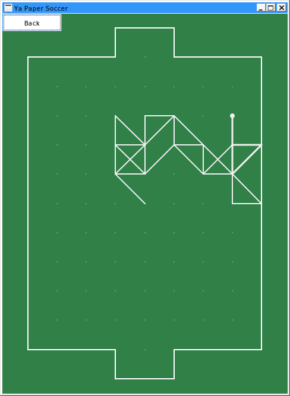

# QtPaperSoccer
Paper Soccer ai made in c++/qt. **Not foolproof and probably prone to crashes**, the GUI was made quickly from the personal project to be somewhat usable to close people. I'm not gonna do much regarding the GUI, but the patches are welcomed.

 


# Download and run

For windows download the zip from [release page](Ya Paper Soccer.zip). Extract and run either **PaperSoccer.exe** or the faster **PaperSoccer-avx2.exe** if it works. The **96_32_net** file must be in the same folder.

For linux (and mac?):

```bash
git clone https://github.com/jdermont/QtPaperSoccer.git
cd QtPaperSoccer/src/
qmake .
make
./PaperSoccer
```

Probably installing qt creator from the linux distro's repo will be enough requirement.
You may want to edit Makefile and add in CXXFLAGS -Ofast -march=native, instead of -O2.


# Usage

After making move the ball will become bigger. Click again to confirm.
For keys to work, the focus should be on the football field window. Start game by pressing *start game* button. Press **backspace** or click button *back* to undo move. Press **shift** to let the computer analyze current position.

Additional options can be set in qtpapersoccer.ini (will be created first time you run the application).

```ini
[General]
computer=false
hidden=96
hidden2=32
kurnikColors=false
moveLimit=750
netfile=96_32_net
poolSize=16777216
threads=4
time=1
```

If you want to analyze a position for few minutes, you should increase the poolSize to 33554432 or 67108864 (or any higher but the number must be power of 2). Watch out for RAM usage! You'd also want to increase moveLimit to 2000 or even 5000, otherwise the win/lose situation may be inaccurate. Paper soccer can have insane branching factor (possible moves in 1 turn).


# AI

The AI uses neural network for board evaluation. It's rather small, with one-hots inputs, value network. The search is [Unbounded best-first minimax](https://arxiv.org/abs/2012.10700) with UCT component for exploration. This is more like mcts with evaluation from neural network instead from semi-random games.


# Ya Paper Soccer

Old repository for old android app: https://github.com/jdermont/YaPaperSoccer
